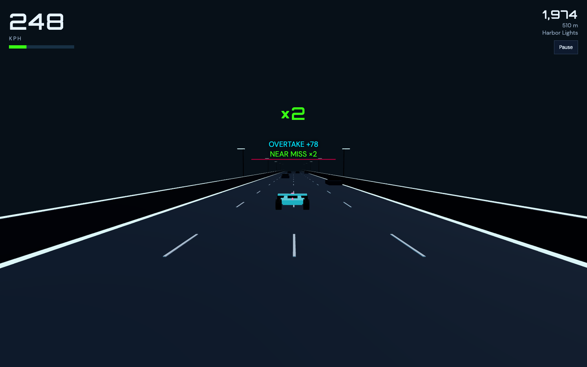

# Formula Runner 2.0

Arcade night-circuit racer. Floor it. Don't stop.

**[Play it in the browser →](https://mcsupplyco.github.io/Formula-Runner-2.0/)**

This repository is the second generation of Formula Runner: a focused, instantly playable web game. The Unity 1.0 prototype lives in [McSupplyCo/Formula-Runner](https://github.com/McSupplyCo/Formula-Runner).



## Play

```bash
npm install
npm run dev
```

Open the local URL, then click **Race**.

| Input | Action |
|---|---|
| A / D or arrows | Steer |
| S / Down | Brake |
| Space or Shift | Boost |
| Esc / P | Pause |
| Drag | Steer on pointer / touch |

## Design

- Auto-accelerate. Steering is independent of throttle.
- Score from distance, speed, near misses, and overtakes.
- Boost charges from near misses.
- Three original cars: Apex, Drift, Surge.
- No licensed F1 teams, tracks, or audio.

## Checks

```bash
npm test
npm run typecheck
npm run build
```

## Landing page

`docs/` holds the project landing page — a self-contained page (no build step, no dependencies) whose hero renders the night circuit in a single WebGL fragment shader.

```bash
npx --yes serve docs   # or: python3 -m http.server -d docs
```

That preview is the landing page only. In-page **Play** buttons point at `play/`, which is not in `docs/`, so those links 404 in this mode. Play the game locally with `npm run dev`.

`.github/workflows/pages.yml` publishes the composed site on every push to `main`: the landing page at the site root, the Vite build at `/play/`. Pull requests run `npm test`, `npm run typecheck`, and `npm run build` without deploying. Pages is set to **Source: GitHub Actions**.

## Linear

Project: [Formula Runner 2.0](https://linear.app/mcsupplyco/project/formula-runner-20-83a9cb34c286)
